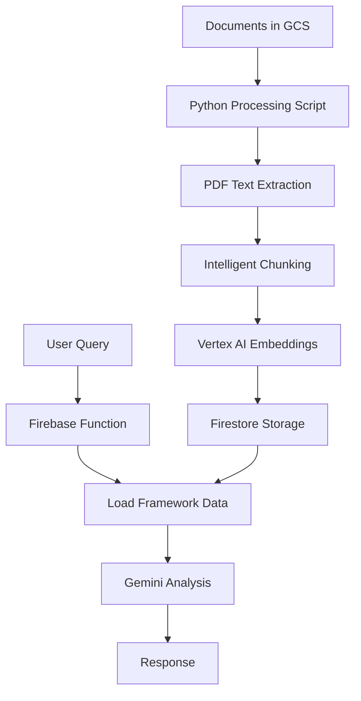

# Complete RAG (Retrieval-Augmented Generation) Implementation Guide

## Table of Contents
1. [Overview](#overview)
2. [Architecture](#architecture)
3. [Prerequisites](#prerequisites)
4. [Google Cloud Setup](#google-cloud-setup)
5. [Document Ingestion Pipeline](#document-ingestion-pipeline)
6. [Embedding Generation](#embedding-generation)
7. [Firestore Schema](#firestore-schema)
8. [RAG Query Process](#rag-query-process)
9. [API Configuration](#api-configuration)
10. [Python Scripts](#python-scripts)
11. [Deployment](#deployment)
12. [Cost Optimization](#cost-optimization)
13. [Troubleshooting](#troubleshooting)

---

## Overview

This guide provides a complete template for building a production-ready RAG system using Google Cloud Platform, Firebase, and Vertex AI. The system processes documents, generates embeddings, stores them in Firestore, and provides intelligent retrieval for AI-powered analysis.

### Key Features
- **Document Processing**: PDF text extraction and intelligent chunking
- **Vector Embeddings**: Using Google's latest `text-embedding-004` model
- **Scalable Storage**: Firestore for metadata and embeddings
- **Real-time Analysis**: Gemini 2.5 Flash for fast, accurate responses
- **Cost Optimized**: Efficient batching and caching strategies

---

## Architecture



### Components
1. **Google Cloud Storage (GCS)**: Document storage
2. **Vertex AI**: Embedding generation and LLM inference
3. **Firestore**: Vector database and metadata storage
4. **Firebase Functions**: Serverless API endpoints
5. **Python Scripts**: Document processing pipeline

---

## Prerequisites

### Required Tools
```bash
# Install Google Cloud CLI
curl https://sdk.cloud.google.com | bash
exec -l $SHELL

# Install Firebase CLI
npm install -g firebase-tools

# Install Python dependencies
pip install -r requirements.txt
```

### Required APIs
- Cloud Storage API
- Firestore API
- Vertex AI API
- Document AI API (optional)
- Cloud Vision API (optional)
- Cloud Functions API
- Firebase APIs

---

## Google Cloud Setup

### 1. Project Creation & Configuration

Run the setup script (choose your platform):

**Linux/Mac:**
```bash
chmod +x scripts/setup-gcloud.sh
./scripts/setup-gcloud.sh
```

**Windows PowerShell:**
```powershell
Set-ExecutionPolicy -ExecutionPolicy RemoteSigned -Scope CurrentUser
.\scripts\setup-gcloud.ps1
```

### 2. Manual Setup (Alternative)

```bash
# Set your project ID
export PROJECT_ID="your-project-id"
gcloud config set project $PROJECT_ID

# Enable required APIs
gcloud services enable storage.googleapis.com
gcloud services enable firestore.googleapis.com
gcloud services enable aiplatform.googleapis.com
gcloud services enable documentai.googleapis.com
gcloud services enable vision.googleapis.com
gcloud services enable cloudfunctions.googleapis.com
gcloud services enable firebase.googleapis.com

# Create service account
gcloud iam service-accounts create rag-functions \
    --display-name="RAG System Functions"

# Grant permissions
SERVICE_ACCOUNT="rag-functions@${PROJECT_ID}.iam.gserviceaccount.com"

gcloud projects add-iam-policy-binding $PROJECT_ID \
    --member="serviceAccount:${SERVICE_ACCOUNT}" \
    --role="roles/storage.admin"

gcloud projects add-iam-policy-binding $PROJECT_ID \
    --member="serviceAccount:${SERVICE_ACCOUNT}" \
    --role="roles/datastore.user"

gcloud projects add-iam-policy-binding $PROJECT_ID \
    --member="serviceAccount:${SERVICE_ACCOUNT}" \
    --role="roles/aiplatform.user"

gcloud projects add-iam-policy-binding $PROJECT_ID \
    --member="serviceAccount:${SERVICE_ACCOUNT}" \
    --role="roles/ml.developer"

# Create GCS bucket
BUCKET_NAME="${PROJECT_ID}-documents"
gsutil mb -p $PROJECT_ID -c STANDARD -l us-central1 gs://${BUCKET_NAME}
gsutil uniformbucketlevelaccess set on gs://${BUCKET_NAME}
```

### 3. Authentication Setup

```bash
# Authenticate with Google Cloud
gcloud auth login
gcloud auth application-default login

# Set up Firebase
firebase login
firebase init
```

---

## 📄 Document Ingestion Pipeline

### 1. Upload Documents to GCS

```bash
# Upload your documents
gsutil cp your-documents/*.pdf gs://${PROJECT_ID}-documents/frameworks/

# Set appropriate permissions
gsutil iam ch allUsers:objectViewer gs://${PROJECT_ID}-documents
```

### 2. Python Processing Script

Create `process_documents.py`:

```python
"""
Document Processing Script for RAG System
Processes PDFs and generates embeddings for Firestore storage.
"""

import os
import sys
from typing import List, Dict, Any
from google.cloud import storage
from google.cloud import firestore
from google.cloud import aiplatform
from google.cloud.aiplatform import TextEmbeddingModel
import pdfplumber
from datetime import datetime
import numpy as np

# Configuration
PROJECT_ID = os.getenv("PROJECT_ID", "your-project-id")
GCS_BUCKET_NAME = f"{PROJECT_ID}-documents"
REGION = "us-central1"
LOCATION = "us-central1"

# Initialize clients
storage_client = storage.Client(project=PROJECT_ID)
firestore_client = firestore.Client(project=PROJECT_ID)
aiplatform.init(project=PROJECT_ID, location=LOCATION)

def extract_text_from_pdf(pdf_bytes: bytes) -> List[Dict[str, Any]]:
    """Extract text from PDF with page information."""
    text_items = []
    
    with pdfplumber.open(pdf_bytes) as pdf:
        for page_num, page in enumerate(pdf.pages, 1):
            text = page.extract_text()
            if text and text.strip():
                text_items.append({
                    "text": text.strip(),
                    "page": page_num,
                    "metadata": {
                        "page_number": page_num,
                        "total_pages": len(pdf.pages)
                    }
                })
    
    return text_items

def chunk_text_intelligent(
    text_items: List[Dict[str, Any]], 
    max_tokens: int = 500, 
    overlap_tokens: int = 50
) -> List[Dict[str, Any]]:
    """Intelligent text chunking with overlap."""
    chunks = []
    
    for item in text_items:
        text = item["text"]
        page = item["page"]
        
        # Simple sentence-based chunking
        sentences = text.split('. ')
        current_chunk = ""
        current_tokens = 0
        
        for sentence in sentences:
            sentence_tokens = len(sentence.split())
            
            if current_tokens + sentence_tokens > max_tokens and current_chunk:
                # Save current chunk
                chunks.append({
                    "text": current_chunk.strip(),
                    "page": page,
                    "tokens": current_tokens,
                    "metadata": item["metadata"]
                })
                
                # Start new chunk with overlap
                overlap_text = '. '.join(current_chunk.split('. ')[-2:])
                current_chunk = overlap_text + '. ' + sentence
                current_tokens = len(current_chunk.split())
            else:
                current_chunk += '. ' + sentence if current_chunk else sentence
                current_tokens += sentence_tokens
        
        # Add final chunk
        if current_chunk.strip():
            chunks.append({
                "text": current_chunk.strip(),
                "page": page,
                "tokens": current_tokens,
                "metadata": item["metadata"]
            })
    
    return chunks

def generate_embeddings(
    texts: List[str], 
    model_name: str = "text-embedding-004",
    task_type: str = "RETRIEVAL_DOCUMENT"
) -> List[List[float]]:
    """Generate embeddings using Vertex AI."""
    try:
        model = TextEmbeddingModel.from_pretrained(model_name)
        
        embeddings = model.get_embeddings(
            texts,
            output_dimensionality=768,  # Cost-optimized dimension
            task_type=task_type
        )
        
        return [list(emb.values) for emb in embeddings]
    except Exception as e:
        print(f"Error generating embeddings: {e}")
        raise

def store_in_firestore(
    collection_name: str,
    document_name: str,
    chunks: List[Dict[str, Any]],
    embeddings: List[List[float]]
) -> None:
    """Store chunks and embeddings in Firestore."""
    
    # Create document metadata
    doc_ref = firestore_client.collection(collection_name).document(document_name)
    doc_ref.set({
        "name": document_name,
        "total_chunks": len(chunks),
        "created_at": datetime.utcnow(),
        "updated_at": datetime.utcnow(),
        "status": "processed"
    })
    
    # Store chunks in subcollection
    chunks_ref = doc_ref.collection("chunks")
    batch = firestore_client.batch()
    batch_count = 0
    
    for i, (chunk, embedding) in enumerate(zip(chunks, embeddings)):
        chunk_doc = chunks_ref.document(f"chunk_{i:04d}")
        
        chunk_data = {
            "text": chunk["text"],
            "page": chunk["page"],
            "chunk_index": i,
            "tokens": chunk["tokens"],
            "embedding": embedding,
            "metadata": chunk["metadata"],
            "created_at": datetime.utcnow()
        }
        
        batch.set(chunk_doc, chunk_data)
        batch_count += 1
        
        # Commit batch every 500 operations (Firestore limit)
        if batch_count >= 500:
            batch.commit()
            batch = firestore_client.batch()
            batch_count = 0
            print(f"  Committed batch of 500 chunks...")
    
    # Commit remaining chunks
    if batch_count > 0:
        batch.commit()
        print(f"  Committed final batch of {batch_count} chunks...")

def process_document(gcs_path: str, collection_name: str, document_name: str):
    """Main processing function."""
    print(f"Processing {document_name} from {gcs_path}...")
    
    # Download from GCS
    bucket = storage_client.bucket(GCS_BUCKET_NAME)
    blob = bucket.blob(gcs_path)
    pdf_bytes = blob.download_as_bytes()
    
    # Extract text
    print("Extracting text...")
    text_items = extract_text_from_pdf(pdf_bytes)
    
    # Chunk text
    print("Chunking text...")
    chunks = chunk_text_intelligent(text_items, max_tokens=500, overlap_tokens=50)
    print(f"Created {len(chunks)} chunks")
    
    # Generate embeddings in batches
    print("Generating embeddings...")
    batch_size = 20  # Avoid token limits
    all_embeddings = []
    
    for i in range(0, len(chunks), batch_size):
        batch_chunks = chunks[i:i + batch_size]
        batch_texts = [chunk["text"] for chunk in batch_chunks]
        
        print(f"Processing batch {i // batch_size + 1}/{(len(chunks) + batch_size - 1) // batch_size}")
        batch_embeddings = generate_embeddings(batch_texts)
        all_embeddings.extend(batch_embeddings)
    
    # Store in Firestore
    print("Storing in Firestore...")
    store_in_firestore(collection_name, document_name, chunks, all_embeddings)
    
    print(f" Successfully processed {document_name}")

if __name__ == "__main__":
    # Example usage
    documents = [
        {
            "gcs_path": "frameworks/iso27001.pdf",
            "collection": "frameworks", 
            "name": "iso27001"
        },
        {
            "gcs_path": "frameworks/nist.pdf",
            "collection": "frameworks",
            "name": "nist"
        }
    ]
    
    for doc in documents:
        try:
            process_document(doc["gcs_path"], doc["collection"], doc["name"])
        except Exception as e:
            print(f" Error processing {doc['name']}: {e}")
```

### 3. Requirements File

Create `requirements.txt`:

```txt
google-cloud-storage==2.14.0
google-cloud-firestore==2.14.0
google-cloud-aiplatform==1.38.1
google-cloud-documentai==2.20.1
pdfplumber==0.10.3
numpy==1.26.2
```

---

## Embedding Generation

### Model Configuration

```python
# Embedding Model Settings
EMBEDDING_MODEL = "text-embedding-004"  # Latest Google model
EMBEDDING_DIMENSION = 768               # Cost-optimized
TASK_TYPE = "RETRIEVAL_DOCUMENT"        # For document storage
BATCH_SIZE = 20                         # Avoid token limits

# Temperature Settings for Generation
GENERATION_CONFIG = {
    "temperature": 0.3,      # Lower for factual responses
    "top_p": 0.95,          # Nucleus sampling
    "top_k": 40,            # Top-k sampling
    "max_output_tokens": 8192  # Large output for detailed analysis
}
```

### Embedding Best Practices

1. **Chunking Strategy**:
   - 500 tokens per chunk (optimal for retrieval)
   - 50 token overlap between chunks
   - Preserve sentence boundaries

2. **Batch Processing**:
   - Process 20 chunks per batch
   - Avoid API rate limits
   - Handle failures gracefully

3. **Storage Optimization**:
   - Use 768 dimensions (cost vs. performance)
   - Store metadata separately
   - Index frequently queried fields

---

## Firestore Schema

### Collection Structure

```javascript
// Firestore Collections
frameworks/                    // Main collection
  ├── iso27001/               // Document ID
  │   ├── name: "ISO 27001"
  │   ├── description: "..."
  │   ├── total_chunks: 150
  │   ├── created_at: timestamp
  │   └── chunks/             // Subcollection
  │       ├── chunk_0001/
  │       │   ├── text: "..."
  │       │   ├── page: 1
  │       │   ├── embedding: [0.1, 0.2, ...]
  │       │   └── metadata: {...}
  │       └── chunk_0002/
  │           └── ...
  └── nist/
      └── ...

policies/                     // User policies
  ├── policy_id/
  │   ├── userId: "user123"
  │   ├── filename: "policy.pdf"
  │   ├── gcsPath: "gs://..."
  │   └── analysisStatus: "completed"
  └── ...

reports/                      // Analysis results
  ├── report_id/
  │   ├── policyId: "policy123"
  │   ├── frameworks: ["iso27001", "nist"]
  │   ├── riskScore: 75
  │   ├── gaps: [...]
  │   └── analysis: "..."
  └── ...
```

### Security Rules

```javascript
// firestore.rules
rules_version = '2';
service cloud.firestore {
  match /databases/{database}/documents {
    // Frameworks are readable by authenticated users
    match /frameworks/{frameworkId} {
      allow read: if request.auth != null;
      allow write: if false; // Only admin/functions can write
      
      match /chunks/{chunkId} {
        allow read: if request.auth != null;
        allow write: if false;
      }
    }
    
    // Users can only access their own policies
    match /policies/{policyId} {
      allow read, write: if request.auth != null 
        && request.auth.uid == resource.data.userId;
    }
    
    // Users can only access their own reports
    match /reports/{reportId} {
      allow read: if request.auth != null 
        && request.auth.uid == resource.data.userId;
      allow write: if false; // Only functions can write
    }
  }
}
```

---

## RAG Query Process

### 1. Simple Approach (Recommended)

```typescript
// Firebase Function - Simplified RAG
export const analyzeDocument = onRequest({
  region: "us-central1",
  cors: true,
  timeoutSeconds: 540,
  memory: "1GiB",
}, async (req, res) => {
  try {
    // 1. Extract document text
    const policyText = await extractPolicyText(policyId);
    
    // 2. Load framework data from Firestore
    const frameworkData = await loadFrameworkData(frameworks);
    
    // 3. Generate analysis with Gemini
    const analysis = await generateAnalysis(policyText, frameworkData);
    
    res.json({ success: true, analysis });
  } catch (error) {
    res.status(500).json({ error: error.message });
  }
});

async function loadFrameworkData(frameworks: string[]): Promise<string> {
  let content = "";
  
  for (const framework of frameworks) {
    const frameworkDoc = await db.collection("frameworks")
      .doc(framework).get();
    
    if (frameworkDoc.exists) {
      content += `\n## ${framework.toUpperCase()}\n`;
      
      // Load chunks
      const chunks = await frameworkDoc.ref
        .collection("chunks").get();
      
      chunks.docs.forEach(doc => {
        const data = doc.data();
        content += `\n**Page ${data.page}**: ${data.text}\n`;
      });
    }
  }
  
  return content;
}
```

### 2. Advanced Approach (With Embeddings)

```typescript
// Advanced RAG with similarity search
async function retrieveRelevantChunks(
  query: string, 
  frameworks: string[], 
  topK: number = 10
) {
  // Generate query embedding
  const queryEmbedding = await generateQueryEmbedding(query);
  
  const relevantChunks = [];
  
  for (const framework of frameworks) {
    const chunks = await db.collection("frameworks")
      .doc(framework)
      .collection("chunks")
      .get();
    
    // Calculate similarities
    const similarities = chunks.docs.map(doc => {
      const data = doc.data();
      const similarity = cosineSimilarity(queryEmbedding, data.embedding);
      
      return {
        text: data.text,
        page: data.page,
        framework,
        similarity
      };
    });
    
    // Get top K most similar
    similarities.sort((a, b) => b.similarity - a.similarity);
    relevantChunks.push(...similarities.slice(0, topK));
  }
  
  return relevantChunks.sort((a, b) => b.similarity - a.similarity);
}

function cosineSimilarity(a: number[], b: number[]): number {
  const dotProduct = a.reduce((sum, val, i) => sum + val * b[i], 0);
  const magnitudeA = Math.sqrt(a.reduce((sum, val) => sum + val * val, 0));
  const magnitudeB = Math.sqrt(b.reduce((sum, val) => sum + val * val, 0));
  return dotProduct / (magnitudeA * magnitudeB);
}
```

---

## API Configuration

### Firebase Functions Setup

```typescript
// functions/src/index.ts
import { setGlobalOptions } from "firebase-functions/v2";

setGlobalOptions({
  maxInstances: 10,
  region: "us-central1",
});

export { analyzeDocument } from "./analyze";
export { uploadDocument } from "./upload";
export { getReports } from "./reports";
```

### Environment Configuration

```typescript
// functions/src/config.ts
export const CONFIG = {
  PROJECT_ID: process.env.GCLOUD_PROJECT || "your-project-id",
  REGION: "us-central1",
  VERTEX_AI_LOCATION: "us-central1",
  
  // Models
  EMBEDDING_MODEL: "text-embedding-004",
  GENERATION_MODEL: "gemini-2.5-flash",
  
  // Storage
  GCS_BUCKET: `${process.env.GCLOUD_PROJECT}.firebasestorage.app`,
  
  // Collections
  COLLECTIONS: {
    FRAMEWORKS: "frameworks",
    POLICIES: "policies", 
    REPORTS: "reports"
  }
};
```

---

## Python Scripts

### Complete Processing Script

The main processing script is quite long. Here's the structure:

```python
# process_documents.py (Full script available on request)
"""
Complete document processing pipeline:
1. PDF text extraction with pdfplumber
2. Intelligent chunking with overlap
3. Batch embedding generation
4. Firestore storage with metadata
5. Error handling and logging
"""

# Key functions:
- extract_text_from_pdf()      # PDF processing
- chunk_text_intelligent()     # Smart chunking
- generate_embeddings()        # Vertex AI embeddings
- store_in_firestore()         # Database storage
- process_document()           # Main pipeline
```

### Utility Scripts

```python
# embeddings.py - Embedding utilities
# chunking.py - Text chunking strategies  
# firestore_utils.py - Database helpers
# gcs_utils.py - Storage utilities
```

**Note**: The complete Python scripts are quite extensive. Would you like me to provide them as separate files or focus on specific components?

---

## Deployment

### 1. Deploy Functions

```bash
# Install dependencies
cd functions
npm install

# Deploy to Firebase
firebase deploy --only functions
```

### 2. Run Document Processing

```bash
# Set up Python environment
python -m venv venv
source venv/bin/activate  # Linux/Mac
# or
venv\Scripts\activate     # Windows

# Install dependencies
pip install -r requirements.txt

# Set environment variables
export GOOGLE_APPLICATION_CREDENTIALS="path/to/service-account.json"
export PROJECT_ID="your-project-id"

# Run processing
python process_documents.py
```

### 3. Deploy Frontend (Optional)

```bash
# Build and deploy
cd web
npm run build
firebase deploy --only hosting
```

---

## Cost Optimization

### Embedding Costs
- **text-embedding-004**: $0.00025 per 1K tokens
- **Batch processing**: Reduces API calls
- **768 dimensions**: 50% cost reduction vs 1536

### Storage Costs
- **Firestore**: $0.18 per 100K reads
- **GCS**: $0.020 per GB/month
- **Functions**: $0.40 per million invocations

### Optimization Strategies
1. **Chunk size**: 500 tokens (optimal retrieval vs cost)
2. **Batch processing**: 20 chunks per API call
3. **Caching**: Store frequently accessed data
4. **Compression**: Use smaller embedding dimensions

---

## 🔧 Troubleshooting

### Common Issues

1. **Authentication Errors**
   ```bash
   gcloud auth application-default login
   export GOOGLE_APPLICATION_CREDENTIALS="path/to/key.json"
   ```

2. **API Quota Exceeded**
   ```bash
   # Check quotas
   gcloud compute project-info describe --project=PROJECT_ID
   
   # Request quota increase in GCP Console
   ```

3. **Firestore Permission Denied**
   ```bash
   # Check IAM roles
   gcloud projects get-iam-policy PROJECT_ID
   
   # Add required roles
   gcloud projects add-iam-policy-binding PROJECT_ID \
     --member="serviceAccount:SERVICE_ACCOUNT" \
     --role="roles/datastore.user"
   ```

4. **Embedding Generation Fails**
   ```python
   # Check model availability
   from google.cloud.aiplatform import TextEmbeddingModel
   model = TextEmbeddingModel.from_pretrained("text-embedding-004")
   ```

### Debug Commands

```bash
# Check function logs
firebase functions:log

# Test function locally
firebase emulators:start --only functions

# Check Firestore data
firebase firestore:indexes

# Monitor costs
gcloud billing budgets list
```

---

## 📚 Additional Resources

### Documentation
- [Vertex AI Embeddings](https://cloud.google.com/vertex-ai/docs/generative-ai/embeddings/get-text-embeddings)
- [Firestore Documentation](https://firebase.google.com/docs/firestore)
- [Firebase Functions](https://firebase.google.com/docs/functions)

### Best Practices
- [RAG System Design](https://cloud.google.com/blog/topics/developers-practitioners/rag-applications-vertex-ai)
- [Vector Database Optimization](https://cloud.google.com/blog/topics/developers-practitioners/optimize-vector-similarity-search)

### Community
- [Firebase Discord](https://discord.gg/firebase)
- [Google Cloud Community](https://cloud.google.com/community)

---

##  Quick Start Checklist

- [ ] Create Google Cloud Project
- [ ] Enable required APIs
- [ ] Set up service accounts and IAM
- [ ] Create GCS bucket
- [ ] Initialize Firebase project
- [ ] Upload documents to GCS
- [ ] Run Python processing script
- [ ] Deploy Firebase Functions
- [ ] Test the RAG system
- [ ] Monitor costs and performance

---


*This template is designed to be generic and adaptable to different RAG projects. Customize the configuration, models, and processing logic based on your specific requirements.*
